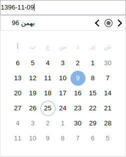
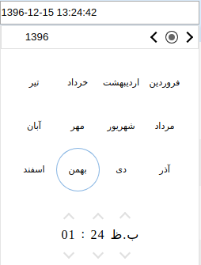

# Angular 13 Farsi Date Picker (Upgraded from ng2-jalali-date-picker)
انتخاب گر تاریخ شمسی در انگولار 14
[دمو](https://fingerpich.github.io/jalali-angular-datepicker/)

## تصاویر

## فهرست مطالب :

 − [نصب کتابخانه](https://github.com/fingerpich/jalali-angular-datepicker#installation)
 - [نحوه استفاده از انتخابگر تاریخ شمسی](https://github.com/fingerpich/jalali-angular-datepicker#how_to_use)
 - [نمایش تاریخ انتخاب شده به صورت های مختلف در تاریخ خورشیدی](https://github.com/fingerpich/jalali-angular-datepicker#how_to_use_the_output_as_a_jalali_shamsi_date)
 - [استفاده یا تغییر صفات انتخابگر تاریخ جلالی](https://github.com/fingerpich/jalali-angular-datepicker#Attributes)
 - [تنظمات انتخابگر تاریخ فارسی](https://github.com/fingerpich/jalali-angular-datepicker#Configuration)
 - [نحوه استفاده از انتخاب گر در داخل کلاس ها](https://github.com/fingerpich/jalali-angular-datepicker#API)
 - [نحوه استفاده از انتخابگر به صورت همیشه ظاهر](https://github.com/fingerpich/jalali-angular-datepicker#Inline_-_Day_Calendar)
 - [نحوه استفاده از انتخابگر مستقل از المنت ورودی](https://github.com/fingerpich/jalali-angular-datepicker#Directive)
